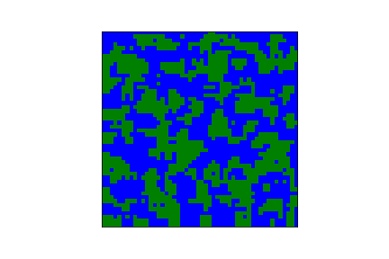
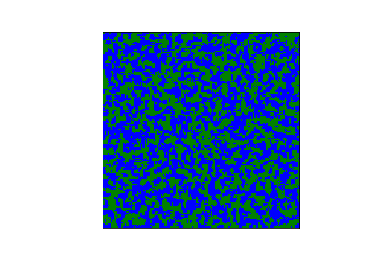
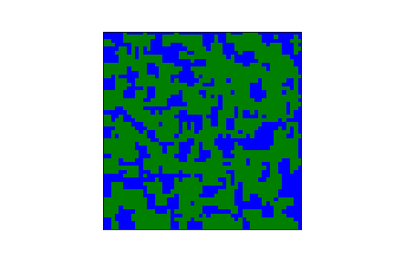
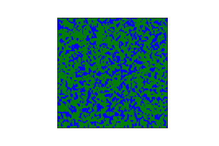

# Simple Ecosystem Simulations 

## Step 1: Procedural Land Generation
I initialized an n x n map with values of 1 or 0 based on a given probability of being land, denoting 1 to be land and denoting 0 to be water. Then, I used Cellular Automata to smooth the random values into land masses. Through my testing, this method creats solid land masses for smaller maps, but creates archipelagoes for larger maps. It is possible to increase the amount of land by tweaking the probability of land; however, it is very sensitive to changes. I am currently tweaking the parameters to determine the amount of land that I want for my ecosystem.

50x50 with 50% probability of land            |  150x150 with 50% probability of land
:-------------------------:|:-------------------------:
  |  
50x50 with 57% probability of land            |  150x150 with 57% probability of land
:-------------------------:|:-------------------------:
  |  

